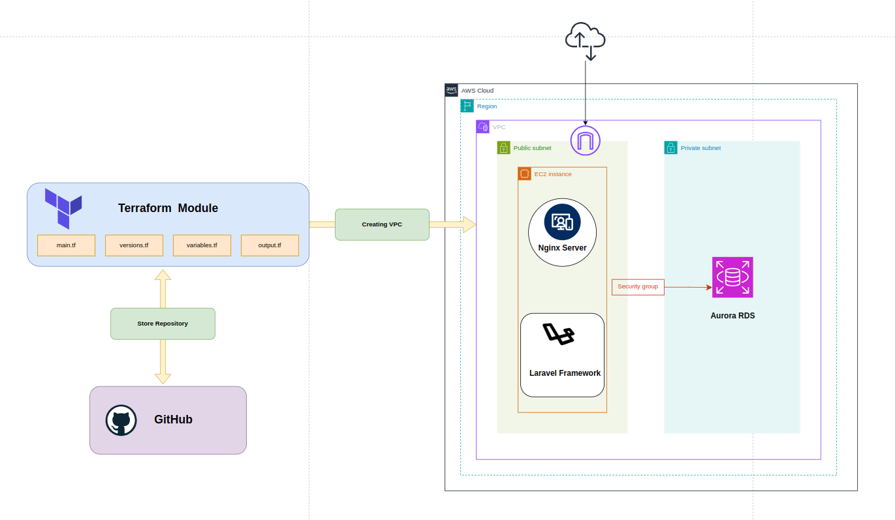

# Ngix-x-Laravel
Created by: Than Htike Soe

<aside>
💡 In this scenerio, I used the Terraform module to establish the VPC, then I used the AWS management console to create the EC2 instance and Aurora RDS. In addition, I use bash scripts to install Laravel and Ngnix. And I use a security group to grant access to RDS from a single EC2 server. I assigned elastic IP to the EC2 instance so that anyone may reach it from the public.

</aside>

### 1. **Create VPC using Terraform Module**

- **Utilize Terraform to provision a Virtual Private Cloud (VPC) with the necessary networking components.**

### 2. **Create EC2 Instance and Assign Elastic IP**

- **Deploy an EC2 instance within the VPC and associate an Elastic IP to ensure a static public IP address.**

### 3. Configure Nginx, Laravel and Aurora RDS(MySQL)

- **Configure and install the Nginx web server on the EC2 instance to handle HTTP requests.**
- **Set up a Laravel project on the EC2 instance, following best practices for security and performance.**
- **Use the AWS Management Console to create an Amazon Aurora RDS instance with MySQL compatibility.**
- ****************Create security group to get access from EC2 instance only.****************
- **Establish a connection between the Laravel application and the Aurora RDS database, ensuring proper credentials and security measures are implemented**

### 4. **Edit Framework with PHP Code as Todo List App**

- **Modify the Laravel framework to implement a Todo List application using PHP code. Incorporate features such as task creation, updating, deletion, and any additional functionalities deemed appropriate.**

************************Source Codes************************

[GitHub - pphein/todo-test](https://github.com/pphein/todo-test.git)

### The result is as per below

**The submission includes documentation, scripts, and relevant files adhering to the assignment requirements. The completed assignment demonstrates proficiency in cloud infrastructure setup, web server configuration, and web application development using the Laravel framework.**